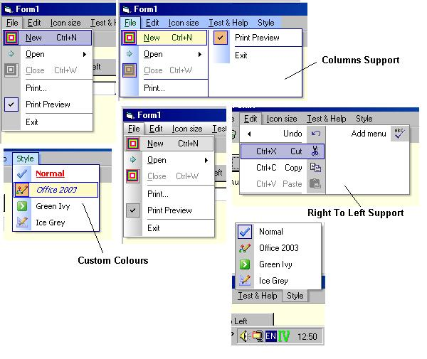



## HookMenu 1\.5

### Description

This control is an update to the excellent HookMenu control written by Vlad

Vissoultchev.

New features/fixes include

o fully customisable colour scheme (allowing Office 2003 style menus)

o new properties dialog

o menu column support

o Accelerator Key support for NT os (thanks Vlad)

o various menu drawing issues

o + Many More

Thanks to Vlad, originally for the control, for help with the Accelerator

key support and his agreement to repost this updated version of the

Hookmenu control.

Also thanks to:

Carles P.V. for his coolist - that was ammended to suit this control.

Any bugs please report.

Updated: 20/11/2003

Thanks To Neal Who Fixed The Bug Relating To The Seperator Lines Being Selected When They Shouldn't.
 
### More Info
 

             |
---                |---
**Submitted On**   |2003-11-18 15:08:34
**By**             |[NR/GN](https://github.com/Planet-Source-Code/PSCIndex/blob/master/ByAuthor/nr-gn.md)
**Level**          |Advanced
**User Rating**    |5.0 (259 globes from 52 users)
**Compatibility**  |VB 6\.0
**Category**       |[Custom Controls/ Forms/  Menus](https://github.com/Planet-Source-Code/PSCIndex/blob/master/ByCategory/custom-controls-forms-menus__1-4.md)
**World**          |[Visual Basic](https://github.com/Planet-Source-Code/PSCIndex/blob/master/ByWorld/visual-basic.md)
**Archive File**   |[HookMenu\_116741711202003\.zip](https://github.com/Planet-Source-Code/nr-gn-hookmenu-1-5__1-49985/archive/master.zip)

